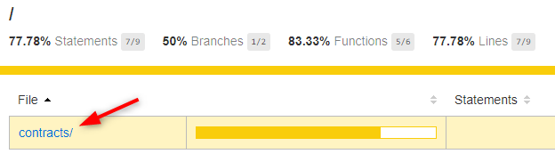
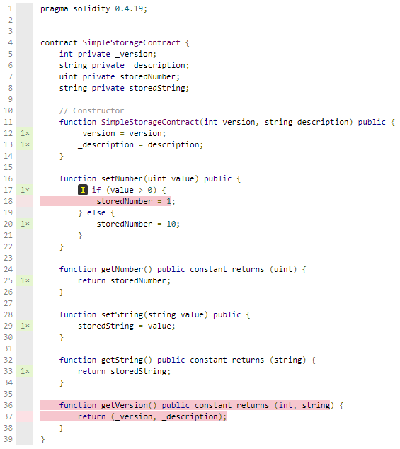

# Lab 2

## Info

This lab (continues on Lab 1) and will teach you how to:

- run code coverage to see how much code is covered by unit-tests
- auto generate C# Interfaces and Service classes from the SmartContract
- deploy the SmartContract using a bare-bone console application to your local Ethereum Blockchain using GETH

## What is Go-Ethereum (GETH)

Go Ethereum is one of the three original implementations (along with C++ and Python) of the Ethereum protocol. It is written in **Go**, fully open source and licensed under the GNU LGPL v3. See also [geth.ethereum.org](https://geth.ethereum.org/).

If you have some generic or detailed questions, please feel free to ask these at mStack colleagues.

## Folder structure

- `Solidity`: folder for the SmartContracts written in Solidity and unit-tests written in javascript.
- `ConsoleApp`: folder for the SmartContracts written in Solidity and unit-tests written in javascript.

## Details

This lab contains two simple SmartContracts:

- `SimpleStorageContract` this contract can store and retrieve number and string values
- `MultiplyContract` this contract is initialized with a default multiply factor and can do some basic multiplications

## Steps

Execute the following steps in order to follow this Lab.

### Step 1

Go to the terminal in VS Code and type:

- `cd Lab 2`
- `cd Solidity`
- `npm i` (to install all required node packages)

### Step 2

Go to the terminal in VS Code and type:

- `npm test`, this command will use [Truffle](https://github.com/trufflesuite/truffle) run the test. Note that also the linter is run.

All tests should pass.

### Step 3

Go to the terminal in VS Code and type:
`npm run coverage`, this command will start a **TestRPC** (a local in-memory Ethereum Virtual Machine in JavaScript) and **Solidity Coverage** to determine the unit-test code coverage.

In the console output, you should see something like:

``` x
[Coverage] ----------------------------|----------|----------|----------|----------|----------------|
[Coverage] File                        |  % Stmts | % Branch |  % Funcs |  % Lines |Uncovered Lines |
[Coverage] ----------------------------|----------|----------|----------|----------|----------------|
[Coverage]  contracts\                 |    77.78 |       50 |    83.33 |    77.78 |                |
[Coverage]   SimpleStorageContract.sol |    77.78 |       50 |    83.33 |    77.78 |          18,37 |
[Coverage] ----------------------------|----------|----------|----------|----------|----------------|
[Coverage] All files                   |    77.78 |       50 |    83.33 |    77.78 |                |
[Coverage] ----------------------------|----------|----------|----------|----------|----------------|
```

A more detailed code coverage HTML file is generated at `Lab 2\Solidity\coverage\index.html`. Open this file in an interner browser. This should look like:


Click the **contracts** link and drill down to the contract file:


### Step 4

Add some more tests to increase the code coverage to 100% by updating the unit-tests in `Lab 2\Solidity\test\SimpleStorageTests.spec.js`.

Rerun the test with `npm run coverage` to verify that the coverage is 100%.

### Step 5

Now that the SmartContract has passed the linter, unit-tests and code-coverage, it's time to start coding in c# to execute some calls on this contract.

Run the command `npm run build` to generate C# Interfaces and Service classes from this SmartContract. You should see this output in the console:

``` x
Compiling contracts
SimpleStorageContract: generate ABI and ByteCode
SimpleStorageContract: generate C# helper classes
SimpleStorageContract: generate C# interfaces
SimpleStorageContract: generate C# implementations
```

### Step 6

Now open a new command terminal in Visual Code, and type:

- `cd Lab 2`
- `cd ConsoleApp`
- `dotnet build` (if all is fine, a restore should be done and the build should complete with 0 errors.)

### Step 7

Now go to the location where the github project is downloaded or clone and double click the `Tools\testchain\startheth.bat` file.

This command will start a local instance from Etherum VM using GO-Eth.

Note that running this can take up some CPU and Memory, so when you're done testing (and before each test with the console-app), just close the cmd window.

### Step 8

Go to the command terminal in Visual Code, and type:

- `dotnet run` to run the ConsoleApp

If all is configured correctly, you should see output like:

``` x
Blockchain - Ethereum - ConsoleApp
--------------------------------------------------------------------------------
Deploying contract (can take some time)
Deploying contract done, address = 0xd0828aeb00e4db6813e2f330318ef94d2bba2f60
```

This means that the contract was deployed successfully and is assigned to that address *0xd0828aeb00e4db6813e2f330318ef94d2bba2f60*.

No extra code is executed yet because all TODO's are still commented. In the next steps C# will be written to execute methods on the contract.

### Step 9

Open the file `Lab 2\ConsoleApp\Program.cs` in Visual Code.

- enable the `TODO 1` code. This code executes the function `SetNumberAsync` as a transaction, wrapping this in a `ExecuteTransactionAsync(...)` call
- also enable `TODO 2` to print out the persisted value to the console logging
- enable `TODO 3` and `TODO 4` to store and retrieve a string from the SmartContract
- Run the ConsoleApp `dotnet run` and the output should lool like:

``` x
Deploying contract (can take some time)
Deploying contract done, address = 0x2e5f6d7138ce653ec0e47101e1c03a7e42d414f2
The stored number value is '10'.
The stored string value is 'mstack.nl test'.
```

### Step 10

- Keep the `startgeth.bat` running
- Remember the address where the contract was deployed in the previous step
- At the `TODO 0` change the value from `deployNewContract` from `true` to `false`
- Also change the value from `contractAddress` from `null` to the Contract address you remembered
- Comment the code at again at `TODO 1` and `TODO 3` to make sure you don't set any values
- Rerun the ConsoleApp `dotnet run` to see that the values which were stored in Step 9 are still persisted in the contract

### Step 11

Done.