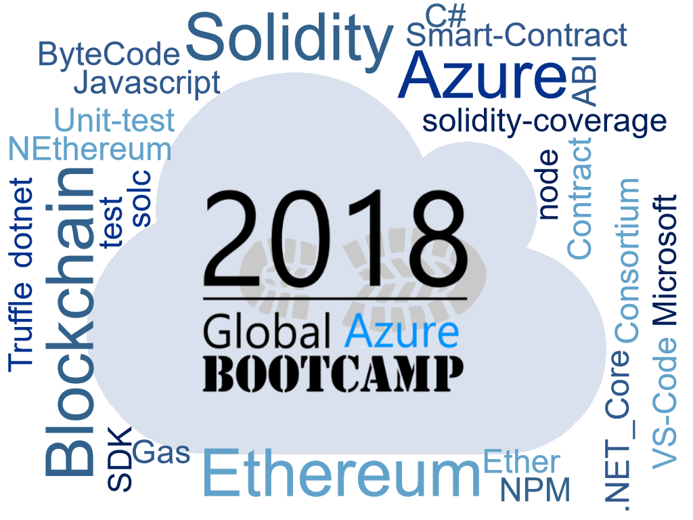

# Global Azure Bootcamp - Ethereum SmartContracts in Azure Blockchain as a Service

## Lab 0

This lab describes all the prerequisite steps you need to do before you can start with the other labs.

## Lab 1 (Beginner)

In this lab you will:

- learn the basics about the Solidity SmartContract programming language
- implement new functionality in a bare-bone SmartContract
- use the Solidity Linter to make sure you write valid code
- update or add unit-test to test this SmartContract

## Lab 2 (Intermediate)

This lab will continue on the basics from Lab 1 and adds the following items you will do:

- run code coverage to see how much code is covered by unit-tests
- auto generate C# Interfaces and Service classes from the SmartContract
- deploy the SmartContract using a bare-bone console application to your local Ethereum Blockchain using GETH

## Lab 3 (Advanced)

This lab continues on Lab 2 and adds the following new things you will learn:

- Deploy the SmartContract to the Azure Blockchain as a Service (based on Ethereum Consortium Blockchain)